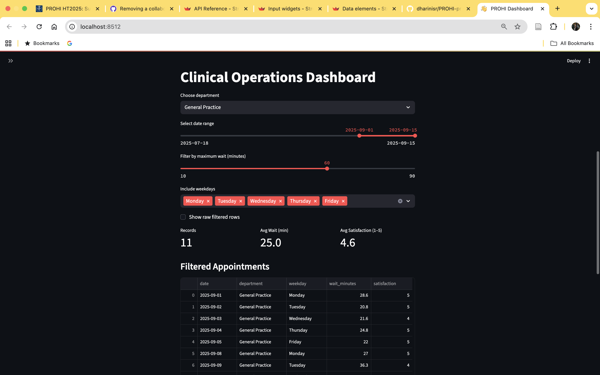
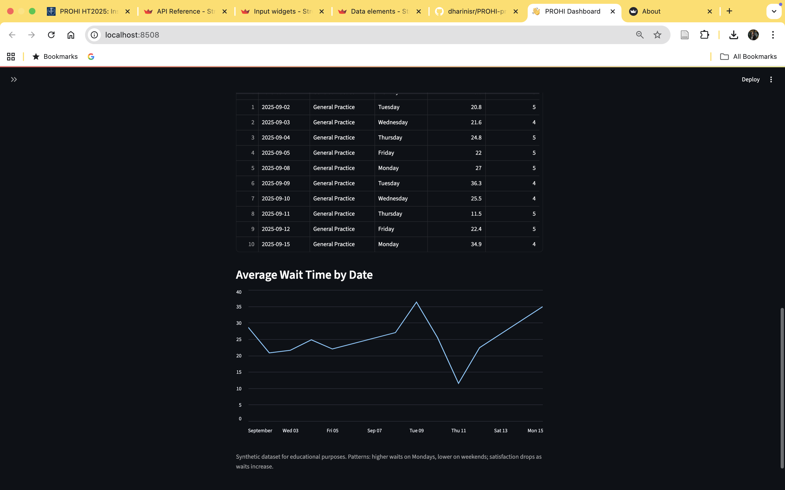
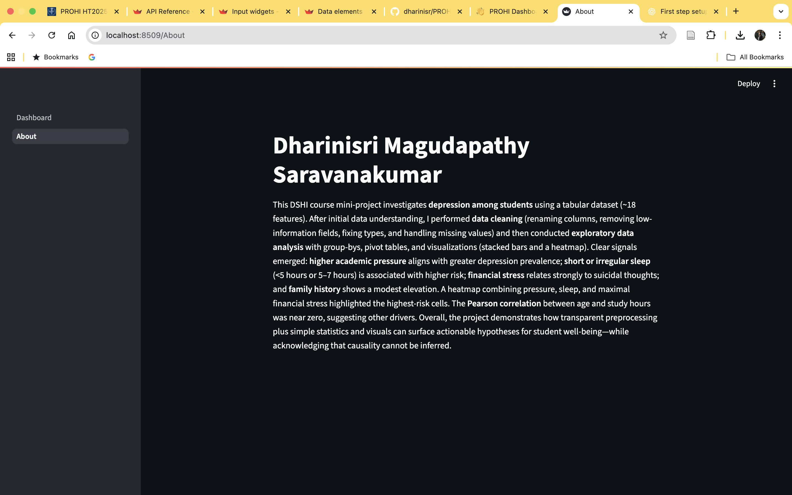

# Clinical Operations Dashboard

**Author**: [Dharinisri]
<!-- As main author, do not write anything in the line below.
The collaborator will edit the line below in GitHub -->


Screenshots

### Dashboard View



### About Page


## Introduction

This project is a **Clinical Operations Dashboard** built with **Streamlit**.  
It demonstrates how interactive dashboards can help visualize and monitor clinic-related data such as **appointments, waiting times, patient satisfaction, and operational patterns**.  

The dashboard includes:  
- Department selection (e.g., Pediatrics, General Practice).  
- Filters for date range, maximum wait times, and weekdays.  
- Key statistics (records, average wait times, satisfaction levels).  
- Tabular display of filtered appointments.  
- Visualizations of wait times and satisfaction trends.  

## System description
The project consists of:  
- `Dashboard.py`: the main dashboard file.  
- `pages/About.py`: contains author information and a project summary.  
- `assets/`: contains images and screenshots. 

### Installation of libraries

Run the commands below in a terminal to configure the project and install the package dependencies for the first time.

If you are using Mac, you may need to install Xcode. Check the official Streamlit documentation [here](https://docs.streamlit.io/get-started/installation/command-line#prerequisites).

1. Create the environment with `python -m venv env`
2. Activate the virtual environment for Python
   - [Linux/Mac] `source env/bin/activate` 
   - [Windows command prompt] `.\env\Scripts\activate.bat` 
   - [in Windows PowerShell] `.\env\Scripts\Activate.ps1`
3. Make sure that your terminal is in the environment (`env`) not in the global Python installation. The terminal should start with the word `env`
4. Install required packages `pip install -r ./requirements.txt`
5. Check that the installation works running `streamlit hello`
6. Stop the terminal by pressing **Ctrl+C**

### Execute custom Dashboard

First, make sure that you are running Python from the environment. Check the steps 2 and 3 above. Then, to run the custom dashboard execute the following command:

```
> streamlit run Dashboard.py
# If the command above fails, use:
> python -m streamlit run Dashboard.py
```

### Dependencies

Tested on Python 3.12.7 with the following packages:
  
  - Streamlit v1.46.1
  

## Contributors

Dharinisri Magudapathy Saravanakumar
